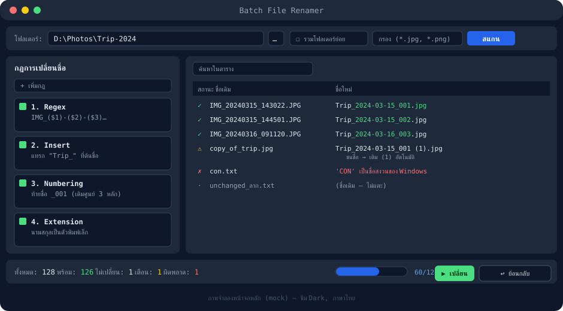
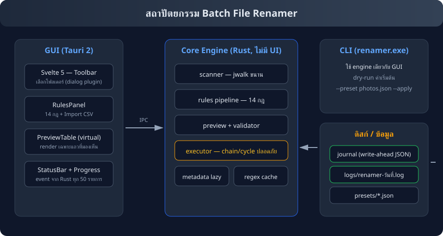
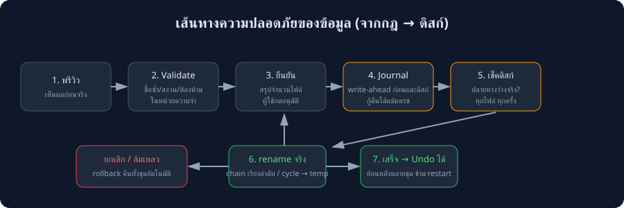

# Batch File Renamer

โปรแกรมเปลี่ยนชื่อไฟล์และโฟลเดอร์จำนวนมากพร้อมกัน — **ปลอดภัยต่อข้อมูล, เร็วระดับไฟล์หลักแสน, เห็นผลลัพธ์ก่อนเปลี่ยนจริงเสมอ**



| | |
|---|---|
| Tech Stack | Rust (core) · Tauri 2 · Svelte 5 |
| แพลตฟอร์ม | Windows (หลัก) · โค้ดเขียน cross-platform |
| ขนาดตัวติดตั้ง | ~3.6 MB (NSIS) / ~5.9 MB (MSI) |
| Performance | พรีวิว 10,000 ไฟล์ × 5 กฎ ≈ **60 ms** |



## ฟีเจอร์

- **นำเข้า:** ปุ่มเลือกโฟลเดอร์แบบ native dialog, recursive + กำหนดความลึก, กรอง wildcard/regex/ขนาด/วันที่, natural sort
- **กฎ 14 ประเภท:** Replace, Regex, Insert, Remove, Case, Numbering, Extension, Date/Time, Metadata (EXIF + แท็กเพลง), Template, Clean up, Swap, Import List (CSV/TXT), Hash/UUID — ซ้อนกันได้ ลากสลับลำดับได้ เปิด/ปิดรายกฎได้
- **Live Preview:** ตาราง virtualized ลื่นแม้แสนแถว, ไฮไลต์ส่วนที่เปลี่ยน, สีสถานะ (เขียว/เหลือง/แดง/เทา), แก้ชื่อใหม่ด้วยมือได้ (ดับเบิลคลิก)
- **ปลอดภัย:** ตรวจชื่อซ้ำ/ชื่อสงวน Windows/อักขระต้องห้าม, เลือกจัดการชนชื่อได้ 3 โหมด, journal write-ahead, rollback อัตโนมัติเมื่อยกเลิก/ล้มเหลว
- **Undo:** ย้อนหลังได้แม้ปิดโปรแกรมแล้ว (journal บนดิสก์) + **แผงประวัติการเปลี่ยนชื่อทั้งชุด** ใน GUI — กด "ย้อนกลับถึงจุดนี้" ต่อ batch (ย้อนชุดกลางจะถอนทุกชุดที่ใหม่กว่าพร้อมกัน; CLI มี `undo` ให้ batch ตัวเองด้วย)
- **Progress แบบ real-time** ระหว่างเปลี่ยนชื่อ + ปุ่มยกเลิก
- **Log รายวัน** สำหรับวิเคราะห์และดีบัก
- **Preset:** บันทึก/โหลดชุดกฎ + preset ในตัว (photos, music)
- **i18n:** ไทย/อังกฤษ, ธีม Dark/Light, คีย์ลัด Ctrl+Enter / Ctrl+Z
- **CLI:** ใช้ engine เดียวกับ GUI, dry-run เป็นค่าเริ่มต้น — apply สำเร็จจะบันทึก batch ลง history ให้ `undo` ใช้ได้ทันที
- **CI อัตโนมัติ (GitHub Actions):** ทุก push/PR รัน cargo + frontend tests; tag `v*` → build NSIS/MSI + เขียน release notes จาก commits ระหว่าง tag ลง GitHub Release เอง
- **พรีวิวและ IPC:** ทุกครั้งที่คำนวณพรีวิว GUI จะซิงก์กฎ, conflict strategy และ apply-to ไปยัง Rust ก่อน; เปลี่ยนตัวเลือกแล้วพรีวิวอัปเดตอัตโนมัติ
- **Regression tests ฝั่ง UI:** ทดสอบลำดับ IPC ก่อนพรีวิวและยืนยันว่า IPC ล้มเหลวแล้วไม่เรียกพรีวิวต่อ



## ติดตั้งและรัน

```bash
cd renamer
npm install
npm run tauri dev              # เริ่ม Vite และเปิดแอป GUI พร้อมกัน
```

อย่าใช้ `cargo run` สำหรับโหมดพัฒนา GUI โดยตรง เพราะไม่ได้เริ่ม Vite ที่ `localhost:5173` ซึ่ง Tauri ต้องใช้; หากต้องการ build frontend แยกให้ใช้ `npm run build`

**Build แจกจ่าย:** `npm run tauri build` → installer อยู่ใน `src-tauri/target/release/bundle/`

## ใช้งาน CLI

```bash
cargo run --bin renamer-cli -- --dry-run preview -f "D:\Photos" -r --include "*.jpg" -p photos
cargo run --bin renamer-cli -- --apply preview -f "D:\Music" -r -p music
cargo run --bin renamer-cli -- undo
cargo run --bin renamer-cli -- presets
```

Exit codes: 0 สำเร็จ · 1 ไม่มีอะไรให้ undo · 2 สแกน/พรีวิวล้มเหลว · 3 rename บางรายการล้มเหลว

## ตัวอย่างการใช้งานจริง

1. **ตั้งชื่อรูปตามวันที่ถ่าย** — preset `photos`: `IMG_20240315_143022.JPG` → `2024-03-15_001.JPG`
2. **จัดชื่อเพลง** — preset `music`: Template `{artist} - {title}` + Clean up
3. **ทำชื่อ URL-friendly** — Clean up (strip accents, space→`-`) + Case lower: `Café Ñandú Ep 1.mp4` → `cafe-nandu-ep-1.mp4`
4. **สลับชื่อไฟล์สองไฟล์** — แก้ชื่อใหม่ด้วยมือ, engine จัดการ cycle ด้วย temp name อัตโนมัติ
5. **ใส่เลขรันแบบ natural sort** — `ep1, ep2, ep10` → `ep001, ep002, ep010`

## เกณฑ์ยอมรับ (automated tests)

| # | เกณฑ์ | ผล |
|---|---|---|
| 1 | Pipeline ครบ → `Trip_2024-03-15_001.jpg` | ✅ |
| 2 | สลับ a.txt ↔ b.txt เนื้อหาถูกต้อง | ✅ |
| 3 | photo.JPG → photo.jpg ไม่ถูกมองว่าชื่อซ้ำ | ✅ |
| 4 | ชื่อซ้ำแจ้งเตือน + auto-suffix `(1)` | ✅ |
| 5 | Natural sort + เลขรัน 001/002/003 | ✅ |
| 6 | Undo หลังปิดโปรแกรม | ✅ |
| 7 | ไทย/อีโมจิ ลบ 1 ตัวแรกไม่มีสระลอย | ✅ |
| 8 | Preview 10k × 5 กฎ ≤ 200 ms | ✅ ~60 ms |

## รันทดสอบ

```bash
cd renamer
npm test          # frontend IPC/preview/undo tests (8 tests)
npm run build     # production build ของ frontend
cd src-tauri
cargo test        # Rust unit + acceptance tests (17 tests)
cargo bench       # benchmark พรีวิว 10k ไฟล์ × 5 กฎ
```

## Logging สำหรับดีบัก

ไฟล์ log รายวันที่ `%APPDATA%/batch-renamer/logs/renamer-YYYY-MM-DD.log`

```bash
RENAMER_LOG=debug cargo run --bin renamer-cli -- --dry-run preview -f "D:\Photos"   # โหมดละเอียด
```

บันทึก: เวลาสแกน/จำนวนไฟล์, เวลาพรีวิวแต่ละรอบ, ทุก rename (โหมด debug), ความล้มเหลว + สาเหตุ, undo ทุกไฟล์, การ rollback
